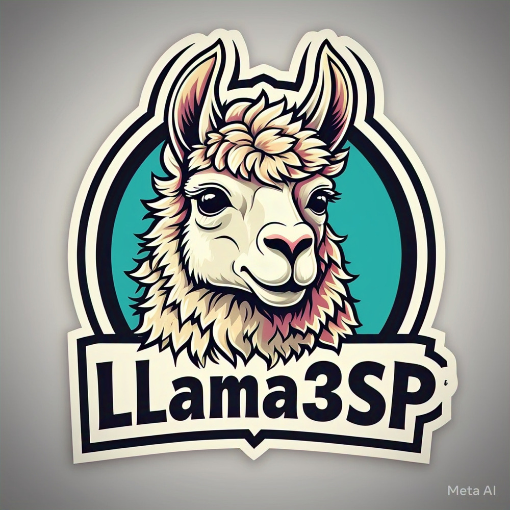

# Llama3SP Replication Package
<!-- PROJECT LOGO -->
 

    
  </a>
  <h3 align="center">Llama3SP</h3>
  

    A Transformer-Based Agile story point estimator Model
     
    Heavyweight Performance, Lightweight Execution
  

<!-- Table of contents -->

  
Table of Contents

  <ol>
    <li>
      <a href="#how-to-replicate">How to replicate</a>
        <ul>
          <li><a href="#about-the-datasets">About the Datasets</a></li>
          <li><a href="#about-the-models">About the Models</a></li>
          <li><a href="#about-the-model-training-process">About the Model Training Process</a></li>
          <li><a href="#about-the-evaluation-results">About the Evaluation Results</a></li>
        </ul>
    </li>
    <li>
      <a href="#acknowledgements">Acknowledgements</a>
    </li>
    <li>
      <a href="#license">License</a>
    </li>
  </ol>

## How to replicate 

### About the Datasets
All of the datasets for 16 different projects are available in the [marked_data folder](https://github.com/DEVCamiloSepulveda/llama3sp/tree/main/sp_dataset/marked_data), each dataset has the following 5 columns:
1. issuekey: Issue ID
2. title: Issue Title
3. description: Issue Description
4. storypoint: Assigned Story Point of the Issue
5. split_mark: Represent whether the row was used as training, validation, or testing  

issuekey | title | description | storypoint | split_mark
| :---: | :---: | :---: | :---: | :---:
...  | ... | ... | ... | ...

### About the Models

#### Model Naming Convention
All of the models on HuggingFace Model Hub has the same naming convention as described in the following table:

Model ID | Model Specification | Experiment Scenario
| :---: | :---: | :---: 
#0  | BPE Llama3.2 Tokenizer + Custom Pre-trained LLaMA 3.2 | Within-Project 
#00  | BPE Llama3.2 Tokenizer + Custom Pre-trained LLaMA 3.2 | Within-Repository 
#000  | BPE Llama3.2 Tokenizer + Custom Pre-trained LLaMA 3.2 | Cross-Repository 
#1  | BPE DeepSeek R1 Tokenizer + Custom Pre-trained DeepSeek R1 | Within-Project 
#2  | Word-levelSP Tokenizer + Custom Pretrained LLaMA 3.2 | Within-Project  
#22  | Word-levelSP Tokenizer + Custom Pretrained LLaMA 3.2 | Within-Repository 
#222  | Word-levelSP Tokenizer + Custom Pretrained LLaMA 3.2 | Cross-Repository  
#3  | BPE Qwen Tokenizer + Custom Pre-trained Qwen | Within-Project 
#6  | WordPieceSP Tokenizer + Custom Pretrained LLaMA 3.2 | Within-Project  
#66  | WordPieceSP Tokenizer + Custom Pretrained LLaMA 3.2 | Within-Repository 
#666  | WordPieceSP Tokenizer + Custom Pretrained LLaMA 3.2 | Cross-Repository  
#7  | SentencePieceSP Tokenizer + Custom Pretrained LLaMA 3.2 | Within-Project  
#77  | SentencePieceSP Tokenizer + Custom Pretrained LLaMA 3.2 | Within-Repository 
#777  | SentencePieceSP Tokenizer + Custom Pretrained LLaMA 3.2 | Cross-Repository  

#### How to access the models
* Three different pre-trained tokenizers can be found in the all_tokenizers folder: [Word-levelSP Tokenizer](https://github.com/DEVCamiloSepulveda/llama3sp/tree/main/all_tokenizers/sp_word_level), [WordPieceSP Tokenizer](https://github.com/DEVCamiloSepulveda/llama3sp/tree/main/all_tokenizers/sp_word_piece), and [SentencePieceSP Tokenizer](https://github.com/DEVCamiloSepulveda/llama3sp/tree/main/all_tokenizers/sp_sentence_piece).
* All of the models included in our experiments can be found on the [Model Hub](https://huggingface.co/DEVCamiloSepulveda) provided by HuggingFace.

### About the Model Training Process
* All of the training scripts for different pre-trained tokenizers included in the experiments (RQ3) can be found in [tokenizer_training_notebook.ipynb](https://github.com/DEVCamiloSepulveda/llama3sp/blob/main/tokenizer_training_notebook.ipynb)
* The model training scripts can be found in [model_training_notebook.ipynb](https://github.com/DEVCamiloSepulveda/llama3sp/blob/main/model_training.ipynb) that contains all of the model training process for our experiments (RQ1 + RQ2 + RQ3)

### About the Model Upload Process
* The process for uploading all the models to the Hugging Face Hub can be found in the [model_upload_notebook.ipynb](https://github.com/DEVCamiloSepulveda/llama3sp/blob/main/model_upload_notebook.ipynb) file.
  
### About the Evaluation Results
* All of the raw predictions from different experiments can be found in the [data_model_analysis folder](https://github.com/DEVCamiloSepulveda/llama3sp/tree/main/data_model_analysis) where we classify the results based on the experimental scenarios (i.e., within-project and cross-project) and each experimental scenario has four different models as follows:
  * Llama3SP
  * SentencePieceSP+Llama3.2
  * Word-levelSP+Llama3.2
  * WordPieceSP+Llama3.2
* There are also some experimental results from a model derived from Llama 3.2.

## Acknowledgements
* Special thanks to the creators of the original GPT2SP research (_GPT2SP: A Transformer-Based Agile Story Point Estimation Approach_) and the research that corrects and improves it (_Agile Effort Estimation: Have We Solved the Problem Yet? Insights From the Replication of the GPT2SP Study_).
* Above all, special thanks to Michael Fu for allowing us to approach and attempt to improve or surpass GPT2SP.
* Special thanks to DeepSE's developers for providing the datasets and the replication package.
* Special thanks to developers from Meta, PyTorch, HuggingFace, Streamlit, Transformers Interpret for providing amazing frameworks for the community.
  
## License 
[MIT License](https://github.com/DEVCamiloSepulveda/llama3sp/blob/main/LICENSE)
